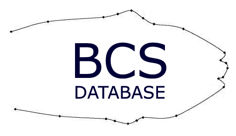

# BODY CONDITION SCORE DATABASE

database source: https://iplab.dmi.unict.it/BCS

## Overview

Computer-aided monitoring of body reserves of dairy cattle is an increasingly research area. The feasibility of estimating the Body Condition Score (BCS) from digital images have been demonstrated in [recent works](https://iplab.dmi.unict.it/BCS/publications.html).

In this research field, a benchmark dataset for quantitative evaluation and comparison of different methods for automatic estimation of BCS is needed.

The BCS Database was created by [Corfilac, IPLAB and Penn Veterinary Medicine joint team](https://iplab.dmi.unict.it/BCS/people.html) as benchmark dataset plublic available for the overall research community. Actually, the BCS Database contains 207 color images corresponding to 29 cow's body shapes acquired with different illumination conditions and rotation angle. No restrictions on cloak, size, age etc. were imposed to the considered cows. The anatomical points of the top aspect of cows have been [manually labeled](https://iplab.dmi.unict.it/BCS/software.html) and stored together with the correspondig BCS estimated weekly on site by two technicians ([see the Dataset](https://iplab.dmi.unict.it/BCS/dataset.html)). The images have been taken by using a cameras placed at the exit of the milking robot.

This Dataset is going to be extended with new samples.

NOTE: The BCS Database is publicly available and can be obtained from this web-site. It is free for academic use. You are free to use the BCS Database for research purposes. If experimental results are obtained that use images from within the database, all publications of these results should acknowledge the use of the "BCS Database" and reference these papers. Without permission, images from within the database cannot be incorporated into a larger database which is then publicly distributed. Commercial distribution or any act related to commercial use of this database is strictly prohibited.

## Publications

- G. Azzaro, M. Caccamo, J.D. Ferguson, S. Battiato, G.M. Farinella, G.C. Guarnera, G. Puglisi, G. Licitra, **Modeling Cow Body Shape for Objective Estimation of Body Condition Score from Digital Images**, in Proceedings of Joint Meeting of ADSA, CSAS, and ASAS 2009G.

- S. Battiato, G. M. Farinella, G. C. Guarnera, G. Puglisi, G. Azzaro, M. Caccamo, **Assessment of Cow's Body Condition Score Through Statistical Shape Analysis and Regression Machines**, Journal of Machine Learning Research: Workshop and Conference Proceedings, International Workshop on Applications of Pattern Analysis, Vol 11, ISSN: 1938-7228, pp. 66-73, Cumberland Lodge, Windsor, UK, 31 Aug - 2 Sept 2010

- G. Azzaro, M. Caccamo, J.D. Ferguson, S. Battiato, G.M. Farinella, G.C. Guarnera, G. Puglisi, R. Petriglieri, G. Licitra, **Objective Estimation of Body Condition Score by Modeling Cow Body Shape from Digital Images**, Journal Dairy Science, Elsevier, USA, ISSN: 0022-0302 (ISI, Impact Factor 2011:2.497), Vol. 94, N. 4, pp. 2126-2137, doi:10.3168/jds.2010-3467, 2011

## Contact
For more information send an email to [DR. Margherita Caccamo](mailto:caccamo@corfiliac.it)